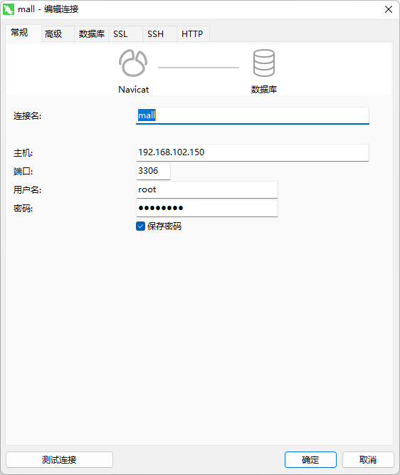
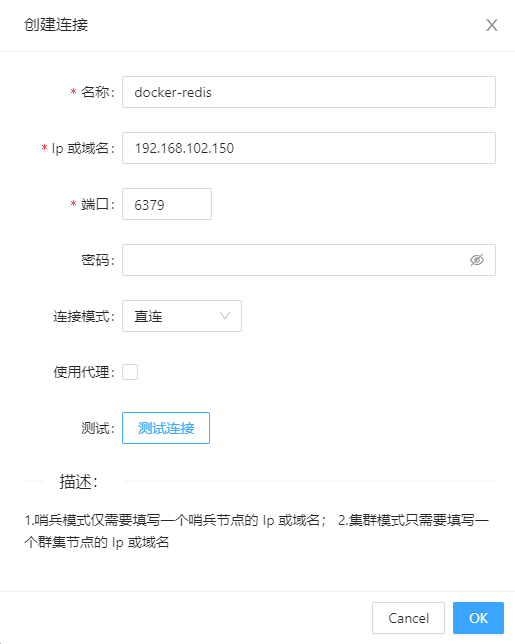

### Install Docker

> TODO

### Docker Mysql

1. 拉取镜像

   ```shell
   sudo docker pull mysql:8.0
   ```

2. 启动容器

   ```shell
   sudo docker run --name mysql -v /usr/local/mysql/data:/var/lib/mysql -v /usr/local/mysql:/etc/mysql/conf.d -v /usr/local/mysql/log:/var/log/mysql  -e MYSQL_ROOT_PASSWORD=root  -p 3306:3306 -d mysql:8.0
   ```

3. 远程连接

     

4. 项目 sql 文件 ==> https://github.com/Luozujian/grainmall/tree/master/data/sql

    ```
    wms ->   ware
    oms ->   order
    pms ->   product
    sms ->   coupon
    ums ->   member
    ```

### Docker Redis

1. 拉取镜像

   ```shell
   docker pull redis:6.0.10
   ```

2. 创建 redis 配置文件 `/usr/local/redis/redis.conf`

   ```text
   bind 0.0.0.0 
   appendonly yes
   ```

3. 启动容器

   ```shell
   docker run --name redis  -v /usr/local/redis/data:/data  -v /usr/local/redis/redis.conf:/usr/local/etc/redis/redis.conf -p 6379:6379 -d redis:6.0.10  redis-server /usr/local/etc/redis/redis.conf
   ```

4. 远程连接

    

   

   

