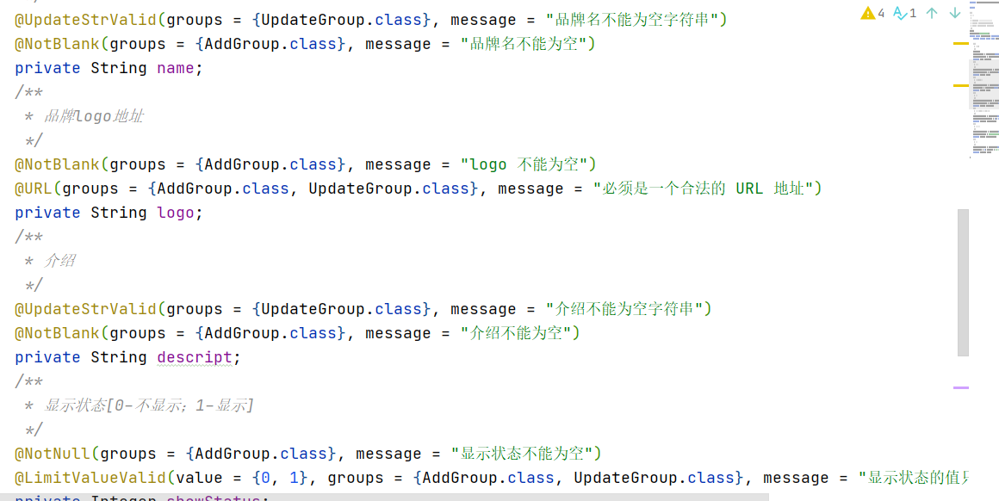

### 基本使用

1. 引入依赖

   ```xml
   <dependency>
       <groupId>org.springframework.boot</groupId>
       <artifactId>spring-boot-starter-validation</artifactId>
   </dependency>
   ```

2. 在对应的实体类属性上使用相关注解

   

3. 在使用该实体类时在前面加上一个 `@Valid` 注解

   ```java
   @RequestMapping("/update")
   public R update(@Valid @RequestBody BrandEntity brand){
   ```

### 分组

> 对于同一个属性可能在不同场景下有不同的规则

1. 创建一个能标识场景的接口类

    

2. 在为属性定义校验规则时指定分组

   

3. 在使用该实体类时在前面加上一个 `@Valid` 注解而不是一个 `@Vaildated` 并指定场景(分组)

   ```java
   @RequestMapping("/update")
   public R update(@Validated(UpdateGroup.class) @RequestBody BrandEntity brand){
   ```

### 自定义校验注解

1. 创建一个注解类

   ```java
   @Documented
   @Constraint(validatedBy = {})
   @Target({ElementType.METHOD, ElementType.FIELD, ElementType.ANNOTATION_TYPE, ElementType.CONSTRUCTOR, ElementType.PARAMETER, ElementType.TYPE_USE})
   @Retention(RetentionPolicy.RUNTIME)
   public @interface LimitValueValid {
   
       String message() default "{pers.prover.mall.common.validation.anno.LimitValue.message}";
   
       Class<?>[] groups() default {};
   
       Class<? extends Payload>[] payload() default {};
   
       int[] value() default {};
   
   }
   ```

   message/groups/payload 三个属性都是必须的

2. 创建 `resources/ValidationMessages.properties` 在里面添加 message 属性的 default 值

   ```properties
   pers.prover.mall.common.validation.anno.UpdateStrValid.message=不允许为空字符串
   pers.prover.mall.common.validation.anno.LimitValueValid.message=值不合法
   ```

3. 实现 **ConstraintValidator<校验注解，属性类型>** 接口创建校验器

   ```java
   public class LimitValueValidatorByInt implements ConstraintValidator<LimitValueValid,Integer> {
   
   
       private final HashSet<Integer> values = new HashSet<>();
   
       @Override
       public void initialize(LimitValueValid constraintAnnotation) {
           // 获取注解中的值
           int[] nums = constraintAnnotation.value();
           for (int num : nums) {
               values.add(num);
           }
       }
   
       @Override
       public boolean isValid(Integer i, ConstraintValidatorContext constraintValidatorContext) {
           // 校验注解
           if (i == null) {
               return true;
           }
           return values.contains(i);
       }
   
   }
   ```

4. 修改注解类的 `@Constraint` 元注解，指定支持的校验器

   ```java
   @Constraint(validatedBy = {LimitValueValidatorByInt.class})
   ```

   


