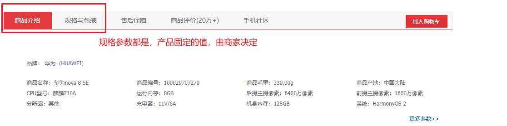
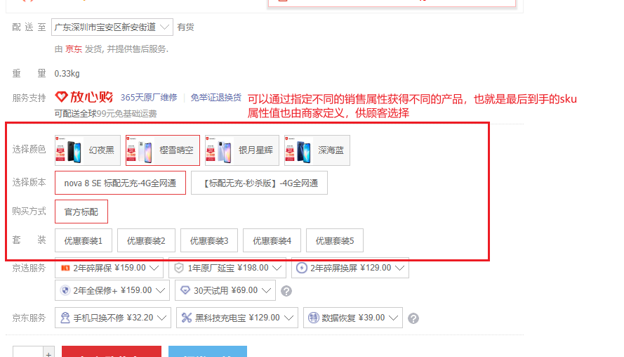

### spu & sku

- 电商系统中用来定义产品的概念

- 可以再引入一个 **分类** 的概念来加以理解

- 分类：产品的分类(华为/小米手机 就是 手机通讯->手机 分类下的)，同时其中也定义了所有可能会使用到的属性(CPU/内存/毛重等)

- spu：分类下的某一款产品(手机分类下的 **HUAWEI nova 8** 就是一个 spu),商家往往可以通过指定一些**规格参数**来确定这一个产品的唯一性

   

- sku：一个产品最后买到的亚子，虽然我们已经可以用 spu 来确定一个产品，但产品中又有一些可以定制的属性来提供给我们的用户选择，我们称这些属性为**销售属性**(机身颜色/版本/套装等)

   