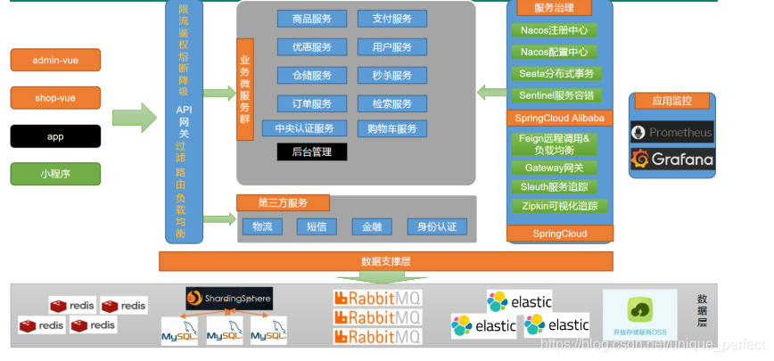

## 分布式基础概念

### 微服务

微服务架构风格，就像是把一个单独的应用程序开发成一套小服务，每个小服务运行在自己的进程中，并使用轻量级机制通信，通常是 HTTP API 这些服务围绕业务能力来构建，并通过完全自动化部署机制来独立部署，这些服务使用不同的编程语言书写，以及不同数据存储技术，并保持最低限度的集中式管理简而言之，拒绝大型单体应用，基于业务边界进行服务微化拆分，每个服务独立部署运行。

### 集群&分布式&节点

- 集群是个物理状态，分布式是个工作方式

- 《分布式系统原理与范型》定义：

  - 分布式系统是若干独立计算机的集合，这些计算机对于用户来说像单个系统

  - 分布式系统 (distributed system) 是建立网络之上的软件系统

  - 分布式是指根据**不同的业务分布在不同的地方**

  - 集群指的是将几台服务器集中在一起，**实现同一业务**

    例如：京东是一个分布式系统，众多业务运行在不同的机器上，所有业务构成
    一个大型的分布式业务集群，每一个小的业务，比如用户系统，访问压力大的
    时候一台服务器是不够的，我们就应该将用户系统部署到多个服务器，也就是
    每一个业务系统也可以做集群化

- 分布式中的每一个节点，都可以做集群，而集群并不一定就是分布式的

- 节点：集群中的一个服务器

### 远程调用

- 在分布式系统中，各个服务可能处于不同主机，但是服务之间不可避免的需要
- 互相调用，我们称之为远程调用

- SpringCloud中使用HTTP+JSON的方式来完成远程调用

### 负载均衡

- 
  分布式系统中，A 服务需要调用B服务，B服务在多台机器中都存在，A调用任意一个服务器均可完成功能

- 为了使每一个服务器都不要太或者太闲，我们可以负载均衡调用每一个服务器，提升网站的健壮性

- 常见的负载均衡算法：

  - 轮询：为第一个请求选择健康池中的每一个后端服务器，然后按顺序往后依次选择，直到最后一个，然后循环

  - 最小连接：优先选择链接数最少，也就是压力最小的后端服务器，在会话较长的情况下可以考虑采取这种方式

### 服务注册/发现&注册中心

- A服务调用B服务，A服务不知道B服务当前在哪几台服务器上有，哪些正常的，哪些服务已经下线，解决这个问题可以引入注册中心

- 
  如果某些服务下线，我们其他人可以实时的感知到其他服务的状态，从而避免调用不可用的服务

### 配置中心

- 每一个服务最终都有大量配置，并且每个服务都可能部署在多个服务器上，我们经常需要变更配置，我们可以让每个服务在配置中心获取自己的配置。
- 配置中心用来集中管理微服务的配置信息

### 服务熔断&服务降级

- 在微服务架构中，微服务之间通过网络来进行通信，存在相互依赖，当其中一个服务不可用时，有可能会造成雪崩效应，要防止这种情况，必须要有容错机制来保护服务

- 情景：订单服务 --> 商品服务 --> 库存服务

  库存服务出现故障导致响应慢，导致商品服务需要等待，可能等到10s后库存服
  务才能响应。库存服务的不可用导致商品服务阻塞，商品服务等的期间，订单服
  务也处于阻塞。一个服务不可用导致整个服务链都阻塞。如果是高并发，第一个
  请求调用后阻塞10s得不到结果，第二个请求直接阻塞10s。更多的请求进来导致
  请求积压，全部阻塞，最终服务器的资源耗尽。导致雪崩

  - 服务熔断：设置服务的超时，当被调用的服务经常失败到达某个阈值，我们可以开启断路保护机制，后来的请求不再去调用这个服务，本地直接返回默认的数据
  - 服务降级：在运维期间，当系统处于高峰期，系统资源紧张，我们可以让非核心业务降级
    运行，降级：某些服务不处理，或者简单处理【抛异常，返回NULL，调用 Mock数据，调用 FallBack 处理逻辑】

### API 网关

在微服务架构中，API Gateway 作为整体架构的重要组件，抽象服务中需要的公共功能，同时它提供了客户端负载均衡，服务自动熔断，灰度发布，统一认证，限流监控，日志统计等丰富功能，帮助我们解决很多API管理的难题

## 电商模式

1. B2B 模式：是指商家和商家建立的商业关系，如阿里巴巴
2. **B2C** 模式：商家与客户端之间简历的关系，直接面向消费销 售产品和服务，如苏宁易购，京东，天猫，小米商城
3. C2B 模式：即消费者对企业，先有消费者需求产生 而后有企业生产，即先有消费者提出需求，后又生产企业按需求组织生产
4. C2C 模式：客户之间通过平台建立联系，如淘宝、咸鱼
5. O2O 模式：将线下商务的机会与互联网 结合在一起，让互联网成为线上交易前台，线上快速支付，线上优质服务，如：饿了么，美团，淘票票，京东到家

## 微服务划分图

