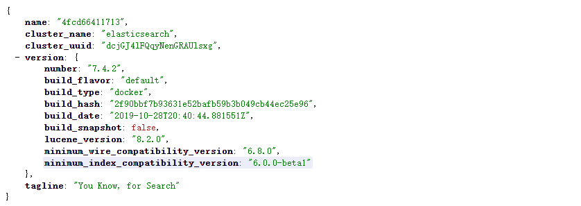
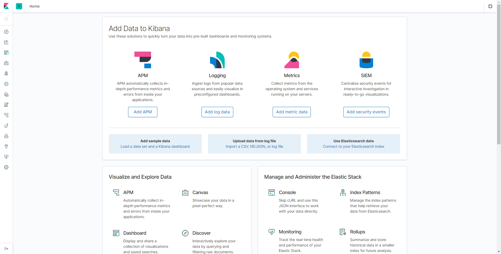

### elasticsearch

#### 学习文档

TODO

#### Docker 安装

1. 拉取镜像:ealastic search（存储和检索）和kibana（可视化检索）

   ```shell
   docker pull elasticsearch:7.4.2
   docker pull kibana:7.4.2
   ```

2. 配置

   ```shell
   # 创建挂载目录
   mkdir -p /mydata/elasticsearch/config
   mkdir -p /mydata/elasticsearch/data
   
   # 修改 es 能被外部访问
   echo "http.host: 0.0.0.0" >/mydata/elasticsearch/config/elasticsearch.yml
   
   # es need 权限
   chmod -R 777 /mydata/elasticsearch/
   ```

3. 启动

   ```shell
   docker run --name elasticsearch -p 9200:9200 -p 9300:9300 \
   -e  "discovery.type=single-node" \
   -e ES_JAVA_OPTS="-Xms64m -Xmx512m" \
   -v /mydata/elasticsearch/config/elasticsearch.yml:/usr/share/elasticsearch/config/elasticsearch.yml \
   -v /mydata/elasticsearch/data:/usr/share/elasticsearch/data \
   -v  /mydata/elasticsearch/plugins:/usr/share/elasticsearch/plugins \
   -d elasticsearch:7.4.2 
   
   
   # 设置开机启动
   docker update elasticsearch --restart=always
   ```

   ```shell
   docker run --name kibana -e ELASTICSEARCH_HOSTS=http://192.168.102.150:9200 -p 5601:5601 -d kibana:7.4.2
   
   
   # 设置开机启动
   docker update kibana  --restart=always
   ```

4. 测试

   访问 `9200` 端口

    

   访问 `5601` 端口

   

5. 下载 ik 分词器 => https://github.com/medcl/elasticsearch-analysis-ik/releases 注意要和 ES 版本一致

6. 将下载的 zip 放到 `/mydata/elasticsearch/plugins/ik` 下并解压(然后记得删除原压缩包)

7. 重启容器即可

   ```shell
   docker restart elasticsearch
   ```

具体使用可以参考[学习文档](#学习文档)


