### 性能压测

#### JVM 内存模型

`.class` 文件通过 **类加载器** 进入到 JVM 中

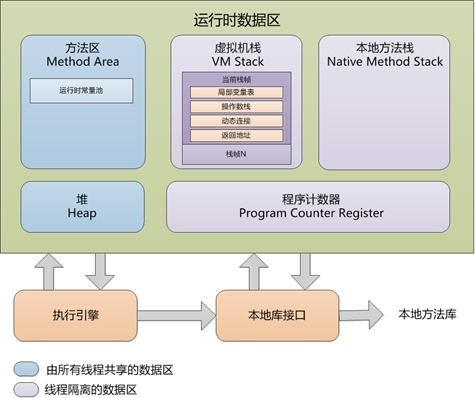

JVM 学习：TODO

#### 堆

所有的对象实例以及数组都要在堆上分配，堆是垃圾收集器管理的主要区域，也被称为 **GC堆**，是我们在进行优化时最多考虑的地方

堆的内部结构：

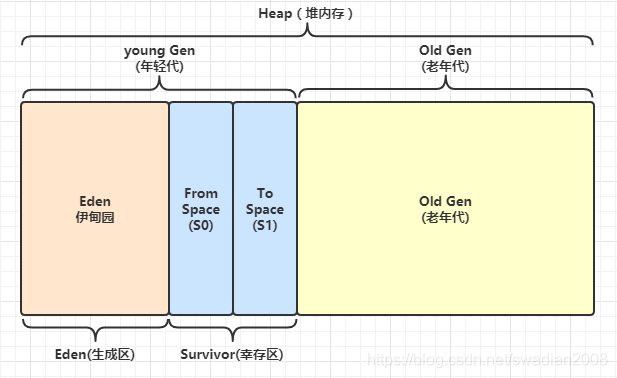

GC(垃圾回收) 流程：

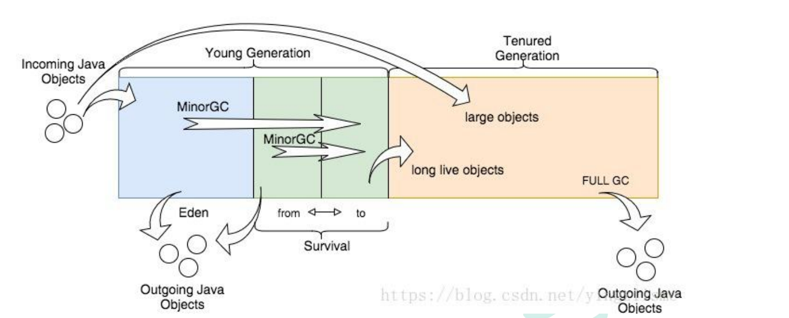

1. 创建一个新对象
2. 判断 Eden 能否放下新对象，如果可以就放下，如果不可以就进行一次 **Minor GC**(小GC，还可以)
   - Minor GC：会将新生代中不用的对象回收掉，然后将原本 **Eden** 中存留的对象转移到 **Survivor**
   - 每个对象经过一次 **Minor GC 就会"升一次级"(等级由内部维护)**，当到达一定等级后，就会将该对象转换到 **Old Gen** 中
   - 当要转移的对象在 **Survivor** 中放不下时，也会直接转移到 **Old Gen** 中
3. 判断 OldGen 能否放下新对象，如果可以就放下，如果不可以就进行一次 **Full GC**(大GC，非常消耗性能)
4. 如果还放不下就报错 OOM(内存用完啦)

#### Jvisualvm

> JDK 自带的工具

##### 作用

监控内存泄露，跟踪垃圾回收，监控执行时内存，CPU 分析，线程分析

##### 启动

- 在命令行输入 `jvisualvm` 即可

- 更新插件

  1. 打开网址：https://visualvm.github.io/pluginscenters.html

  2. 找到与当前 JDK 版本一致的链接

      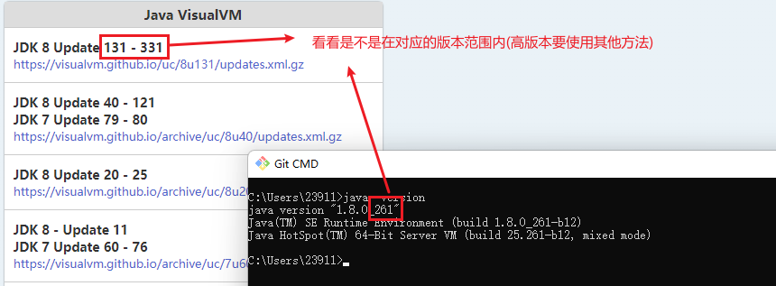

     链接就是下面那个蓝色的

  3. 替换链接

      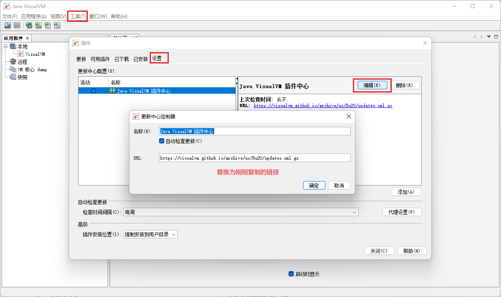

  4. 高版本可以查看：[JDK高版本没有visualvm解决方法](https://blog.csdn.net/qq_28509737/article/details/106541693)

  5. 安装插件

      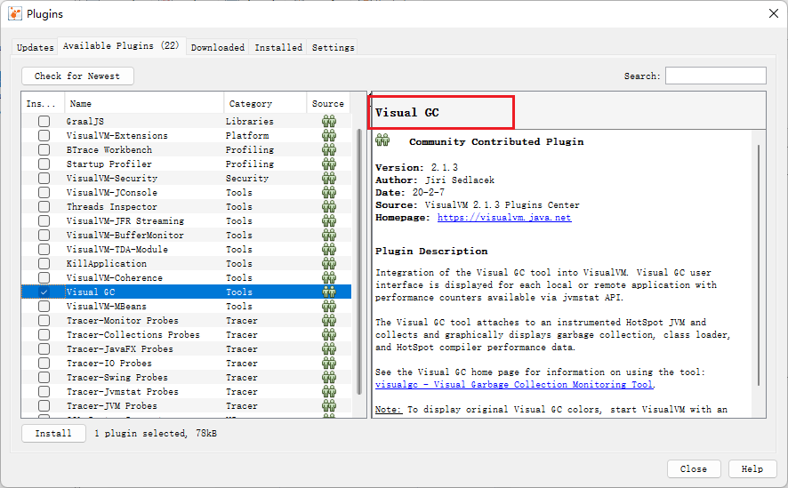

##### 监控

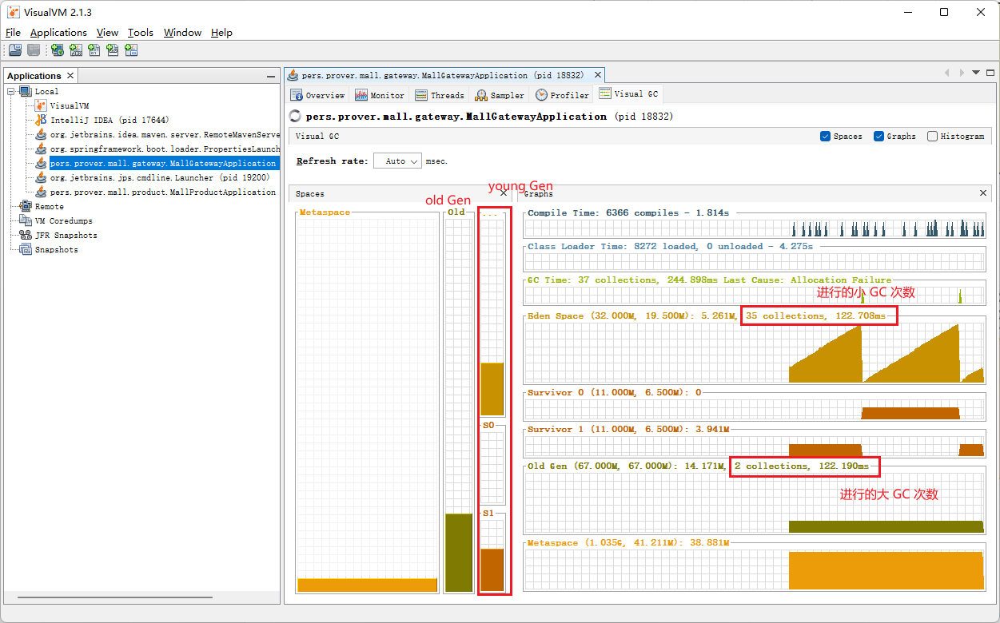

#### Jmeter 压力测试

##### 下载

进入 https://jmeter.apache.org/download_jmeter.cgi

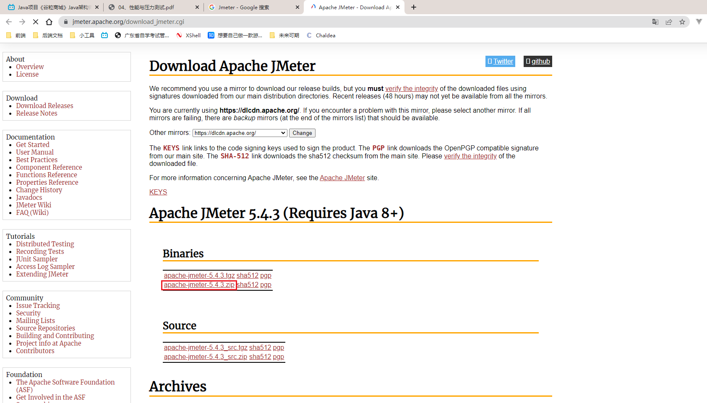

##### 启动

解压后进入到 `bin` 目录下双击 `jmeter.bat` 即可

##### 性能指标

- 响应时间(RT)：从客户端发起一个请求到客户端接收到服务端返回的响应结束，整个过程所耗费的时间
- HPS: 每秒点击次数
- **TPS**：系统每秒处理交易数，单位是笔/秒。
- **QPS**：系统每秒处理查询数，单位是次/秒。(对于互联网业务中，如果某些业务有且仅有一个请求连接，那么TPS=QPS=HPS，一般情况下用 TPS 来衡量整个业务流程，用 QPS 来衡量接口查询次数，用 HPS 来表示对服务器单击请求)
- 三个指标都是越大越好：
  - 金融行业：1000TPS~50000TPS，不包括互联网化的活动 
  - 保险行业：100TPS~100000TPS，不包括互联网化的活动 
  - 制造行业：10TPS~5000TPS 
  - 互联网电子商务：10000TPS~1000000TPS 
  - 互联网中型网站：1000TPS~50000TPS 
  - 互联网小型网站：500TPS~10000TPS
- 最大响应时间（Max Response Time）:指用户发出请求或者指令到系统做出反应（响应）的最大时间。
- 最少响应时间（Mininum ResponseTime）:指用户发出请求或者指令到系统做出反应（响应）的最少时间。
- 90%响应时间（90% Response Time）:是指所有用户的响应时间进行排序，第90%的响应时间。
- 从外部看，性能测试主要关注三个指标：
  - 吞吐量：每秒钟系统能够处理的请求数、任务数。 
  - 响应时间：服务处理一个请求或一个任务的耗时。 
  - 错误率：一批请求中结果出错的请求所占比例。

##### 使用

1. 添加一个线程组

    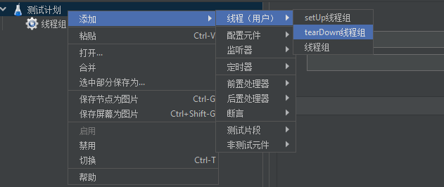

   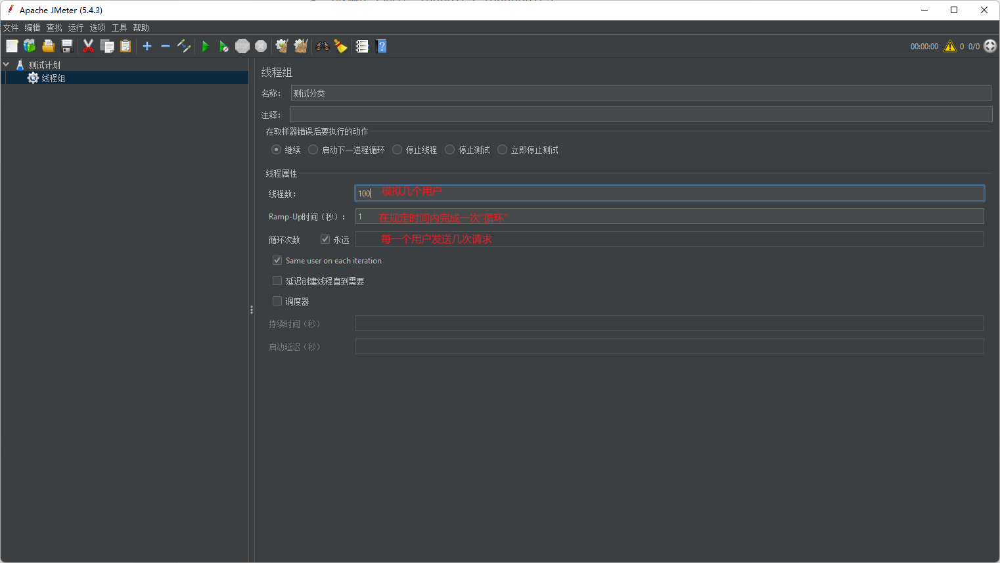

2. 添加 HTTP 请求

    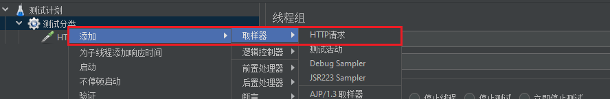

   填写相关请求信息

   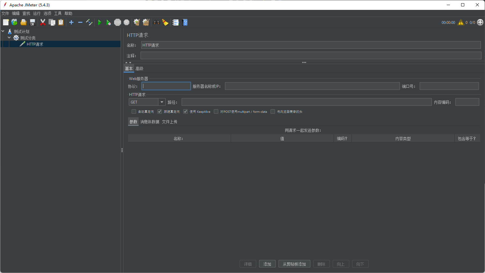

3. 添加相应的响应结果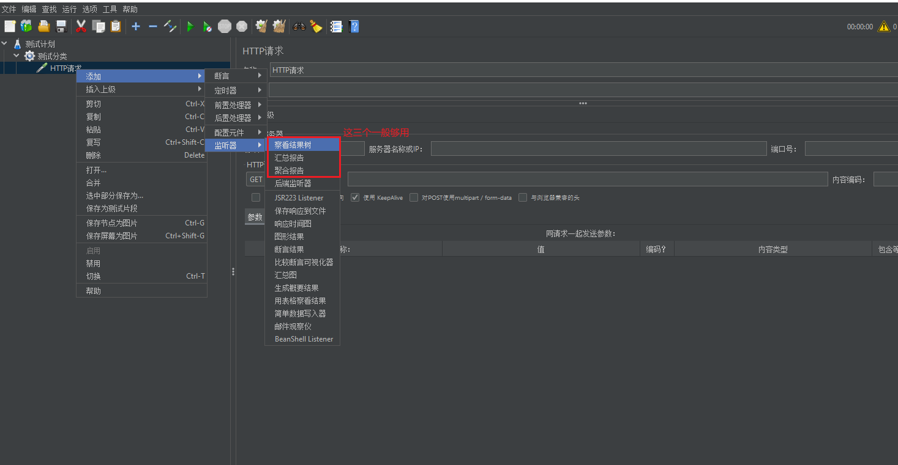

4. 点击上方绿色的箭头就可以开始运行啦

#### 性能优化建议

##### Nginx 动静分离

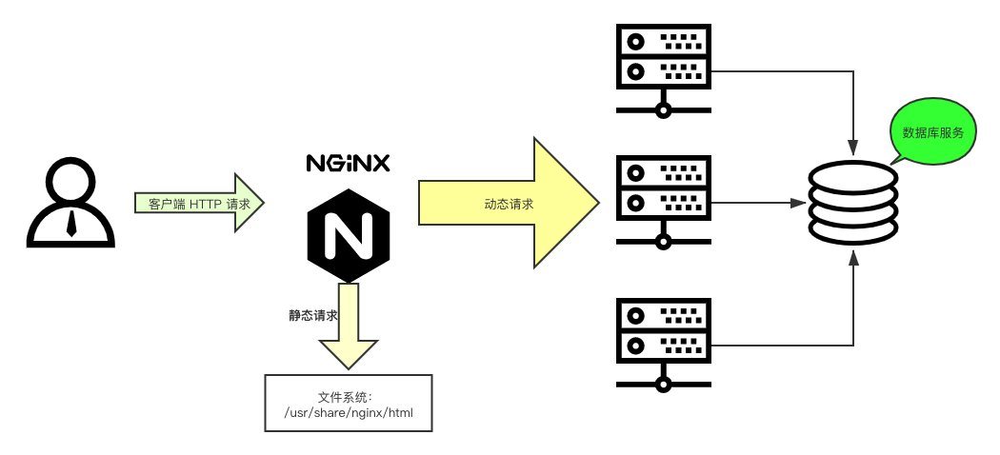

将所有的静态文件转移到 Nginx 服务器上，修改 `conf` 文件

```shell
location /static {
	# 静态资源存放目录
    root /usr/share/nginx/html;
}
```

修改静态资源访问路径

 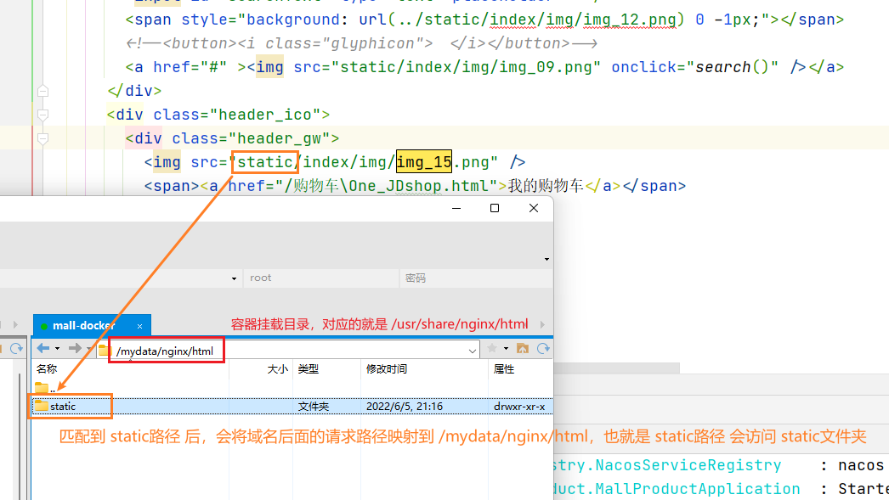

##### 添加数据库索引

MySQL 高级：TODO

##### 优化业务逻辑

- 减少I/O逻辑(数据库I/O，网络I/O，磁盘I/O等)
- 可以通过 **jvisualvm** 监控 CG 的次数，避免出现太多的 Full GC
- 提高服务的占用内存(JVM 调优: TODO)
  - -Xmx4g：堆内存最大值为4GB。
  - -Xms4g：初始化堆内存大小为4GB 。
  - -Xmn1200m：设置年轻代大小为1200MB。**增大年轻代后，将会减小年老代大小**。此值对系统性**能影响较大**，Sun官方推荐配置为整个堆的3/8。

##### 使用缓存

- Redis：TODO