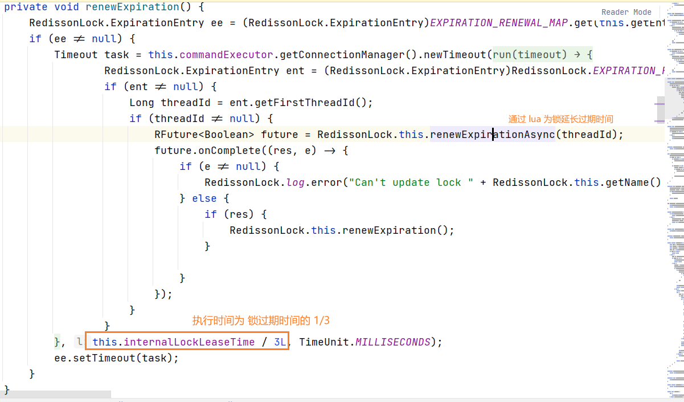
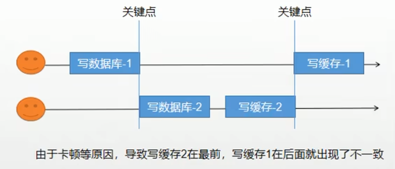
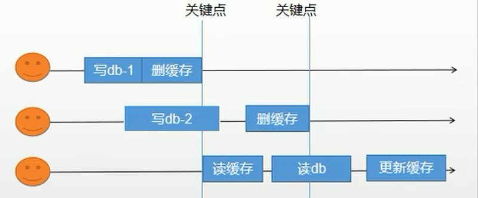
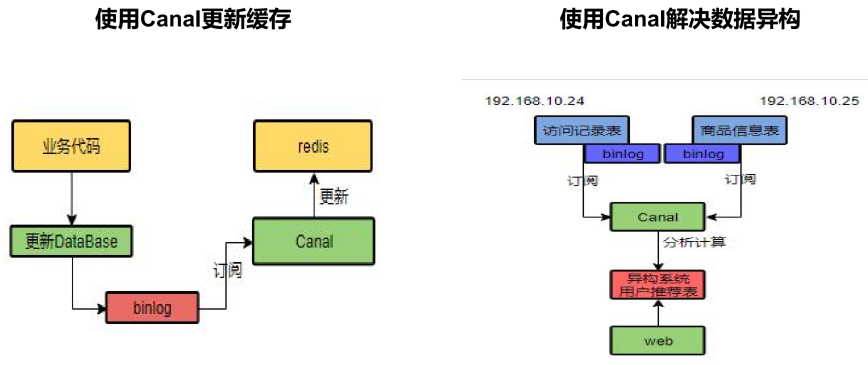
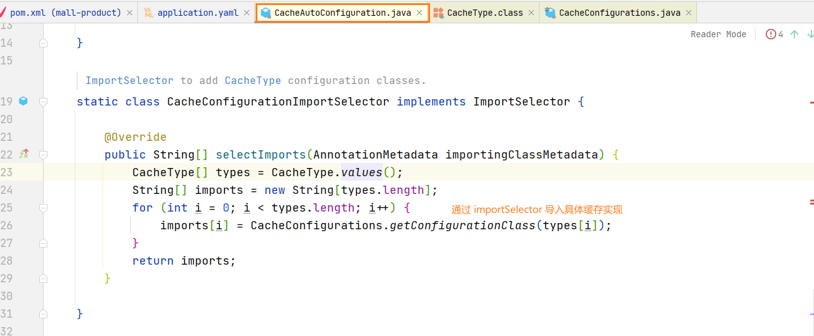
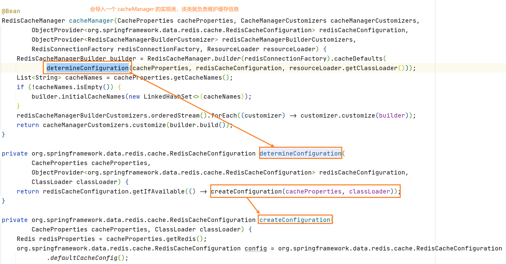
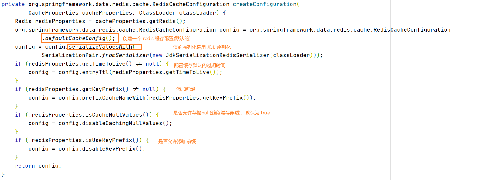

## 缓存

### Redis

学习笔记：TODO

### 缓存失效三大场景

缓存穿透：

- 用户不断的访问**缓存和数据库中都没有的数据**，导致数据库压力过大
- 解决：缓存空对象(null), 布隆过滤器，mvc 过滤器

缓存雪崩：

- 当我们设置缓存时 key 采用了相同的过期时间，导致缓存在某一个时刻**同时失效**，导致请求全部转发到 DB，DB瞬时压力过重雪崩
- 解决
  1. 规避雪崩：缓存的数据**过期时间设置随机值**，避免同一时刻大量数据过期现象发生
  2. 如果缓存数据库是分布式部署的，可以将**热点数据均匀分布在不同缓存数据库中**
  3. 设置热点数据永不过期
- 出现雪崩时如何解决？
  - 事前：搭建高可用的 redis 集群(主从，哨兵模式等)
  - 事中：本地 ehcache缓存 + hystrix限流&降级，避免 DB 崩掉
  - 事后：通过 redis 持久化机制(RDB/AOF)保存的数据恢复缓存

缓存击穿：

- 用户并发的查找同一条数据(热带数据)，但由于缓存中没有数据库的数据(缓存过期等因素)，这时由于并发用户特别多，同时缓存中又读不到数据，这时请求都同时去数据库拉取数据，引入数据库压力瞬间增大

- 解决：
  1. 设置热点数据永不过期
  2. **加锁**

### 缓存击穿：加锁

大体的流程：

1. 查询缓存中是否有数据，有就直接返回
2. 加锁
3. 在查一遍缓存，如果有就直接返回(可能在等待锁的期间，数据已经保存到缓存了，所以要在查一遍)，查找数据库
4. 将数据库中的数据保存到缓存中
5. 解锁

#### 1) synchronized(this)

- 优点：编码简单
- 缺点：本地锁，只适合单机应用

#### 2）Redis 分布式锁

- 主要是通过 `setnx`,该操作在 Redis 中是 **原子性的** 且同一时刻只能成功设置一个(注意：key 的名字是同一个才行)

- 存在问题和解决方案

  1. 没有设置成功(没有抢到锁)：将线程阻塞一会后(sleep)再尝试获取

  2. 设置锁成功，但执行时服务器出现宕机，没有成功执行释放锁的逻辑，造成了死锁：设置过期时间

  3. 业务还未执行完成，锁就过期了，释放锁的时候释放了别人的(同一个 key)：可以将对应的 value 设置成 uuid，删除锁前判断锁当前的 value 和之前保存的 uuid 是否相同，如果相同再删除

  4. 释放锁时，锁刚刚好过期，又把别人的锁释放了：删除锁时保证查找和删除是原子的，可以使用 redis + lua 脚本完成

     ```lua
     if redis.call("get",KEYS[1]) == ARGV[1] 
     then
     	return redis.call("del",KEYS[1])
     else
         return 0
     end;
     ```

- 代码实例：

  ```java
  @Autowired
  private StringRedisTemplate redisTemplate;
  
  // lua 脚本
  private final String delLockLuaScript = "if redis.call(\"get\",KEYS[1]) == ARGV[1] \n" +
      "then\n" +
      "\treturn redis.call(\"del\",KEYS[1])\n" +
      "else\n" +
      "    return 0\n" +
      "end;";
  
  @Override
  public Map<Long, List<CategoryLevel2RespVo>> listMapByParentId() {
      // 获取缓存是否缓存
      String value = redisTemplate.opsForValue().get("product:category:listMapByParentId");
      // 如果不存在就查找 db
      if (StringUtils.isBlank(value)) {
          // 加锁: setIfAbsent == setnx
          Boolean ifAbsent = redisTemplate.opsForValue().setIfAbsent(
              "product:category:listMapByParentIdLock",
              String.valueOf(Thread.currentThread().getId()),
              300, TimeUnit.SECONDS
          );
          // 加锁成功
          if (ifAbsent != null && ifAbsent) {
              Map<Long, List<CategoryLevel2RespVo>> result;
              try {
                  // 查找数据库(TODO: 内部还有查找一次 redis，可以设置一个标识位，如果是查找 redis 的直接返回就好了)
                  result = getLongListMapForDb();
                  // 将数据保存到缓存中
                  redisTemplate.opsForValue().set(
                      "product:category:listMapByParentId",
                      JSON.toJSONString(result),
                      300, TimeUnit.SECONDS
                  );
              } finally {
                  // 释放锁(通过执行 lua 脚本保证锁的检查和删除操作的原子性)
                  redisTemplate.execute(new DefaultRedisScript<Long>(delLockLuaScript, Long.class),
                                        Collections.singletonList("product:category:listMapByParentIdLock"),
                                        String.valueOf(Thread.currentThread().getId()));
              }
              return result;
          } else {
              try {
                  // 线程阻塞后再次查找(自旋锁)
                  Thread.sleep(200);
                  return listMapByParentId();
              } catch (InterruptedException e) {
                  e.printStackTrace();
              }
          }
      }
      // 如果存在就转换未对象(存储的是 json 字符串)后返回
      return JSON.parseObject(value, new TypeReference<Map<Long, List<CategoryLevel2RespVo>>>() {});
  }
  
  private Map<Long, List<CategoryLevel2RespVo>> getLongListMapForDb() {
          // 获取是否存在缓存数据
          String value = redisTemplate.opsForValue().get("product:category:listMapByParentId");
          // 如果不存在就查找 db
          if (!StringUtils.isBlank(value)) {
              return JSON.parseObject(value, new TypeReference<Map<Long, List<CategoryLevel2RespVo>>>() {});
          } else {
              // db 获取所有分类信息
              ..
          }
  }
  ```

#### 3）Redisson

##### 安装

- 官方文档：https://github.com/redisson/redisson/wiki

- 简介：Redission 主要处理分布式场景下有关 Redis 的服务，例如分布式对象(BitSet, Set, Multimap, SortedSet, Map, List, Queue, BlockingQueue, Deque, BlockingDeque),分布式锁(Semaphore, Lock, AtomicLong, CountDownLatch等)，Redisson 提供了使用 Redis 的最简单和最便捷的方法。Redisson 的宗旨是促进使用者对 Redis 的关注分离（Separation of Concern），从而让使用者能够将精力更集中地放在处理业务逻辑上。

- 环境搭建:

  1. 导入依赖

     ```xml
     <dependency>
         <groupId>org.redisson</groupId>
         <artifactId>redisson</artifactId>
         <version>3.13.4</version>
     </dependency>
     ```

  2. 编写配置

     ```java
     @Configuration
     public class RedissonConfig {
     
         @Value("${spring.redis.host}")
         private String redisHost;
     
         @Bean(destroyMethod="shutdown")
         RedissonClient redisson() throws IOException {
             Config config = new Config();
             config.useSingleServer()
                 .setAddress("redis://" + redisHost + ":6379");
             return Redisson.create(config);
         }
     
     }
     ```

##### 使用

> TODO：JUC

###### 可重入锁

概念：当 A 调用 B 时，如果 AB 都需要同一把锁，此时对于可重入锁来说，该锁可用，反之(不可重入锁)，会导致死锁

使用：

```java
// 获取可重入锁
RLock lock = redissonClient.getLock("product:category:listMapByParentIdLock");
// 上锁(阻塞式等待，如果没有抢到锁就会一直等待)
lock.lock();

try {
    ...处理业务逻辑
} finally {
    // 释放锁
    lock.unlock();
}
```

###### 看门狗

概念：实现锁的自动续期，避免由于业务处理时间过长，导致锁自动过期

原理：在 Redisson 实例被关闭之前，会通过一个 Task(定时任务) **延长锁的有效期**，Redisson 中锁的默认过期时间为 30s，定时任务的执行时间为过期之间的 1/3 也就是默认 10s 延长一次，可以通过 **config.setLockWatchdogTimeout()** 修改

```java
@Bean(destroyMethod="shutdown")
RedissonClient redisson() {
    Config config = new Config();
    config.useSingleServer()
        .setAddress("redis://" + redisHost + ":6379");
    // config.setLockWatchdogTimeout() // 设置锁的默认过期时长
    return Redisson.create(config);
}
```

 

在代码中也可以通过指定锁的过期时间从未避免使用看门狗

```java
// 加锁以后10秒钟自动解锁，看门狗不续命
lock.lock(10, TimeUnit.SECONDS);

// 尝试加锁，最多等待100秒，如果 100 秒内没有拿到就返回 false，加锁以后10秒钟自动解锁，看门狗不续命
boolean res = lock.tryLock(100, 10, TimeUnit.SECONDS); 
```

###### 读写锁

概念：针对同一个 key，允许又多个读锁和一个写锁

使用：

```java
@Autowired
private RedissonClient redissonClient;

@RequestMapping("/write")
public String write() {
    // 获取读写锁
    RReadWriteLock readWriteLock = redissonClient.getReadWriteLock("read-write-lock");
    // 获取写锁
    RLock rLock = readWriteLock.writeLock();
    // 抢占写锁
    rLock.lock();
    try {
        Thread.sleep(5000);
    } catch (InterruptedException e) {
        e.printStackTrace();
    }
    // 解锁
    rLock.unlock();
    return "ok";
}

@RequestMapping("/read")
public String read() {
    // 获取读写锁
    RReadWriteLock readWriteLock = redissonClient.getReadWriteLock("read-write-lock");
    // 获取读锁
    RLock rLock = readWriteLock.readLock();
    rLock.lock();
    // try {
    //     Thread.sleep(5000);
    // } catch (InterruptedException e) {
    //     e.printStackTrace();
    // }
    System.out.println("读取数据...");
    rLock.unlock();
    return "读取成功";
}
```

总结：只要访问写锁就会导致业务阻塞(写写，先写再读，先读再写)，如果只访问读锁，那和无锁没有区别

###### 信号量

概念：通过在 Redis 中存储一个数字，当这个数字大于0时，可以通过调用 `release()` 方法增加数量，也可以通过 `acquire()` 方法减少数量，但是当调用 `acquire()` 时如果对导致该**数字小于0的话方法会阻塞**，直到数字大于0

使用：

```java
@RequestMapping("/release")
public String release() {
    RSemaphore semaphore = redissonClient.getSemaphore("count");
    semaphore.release();
    // 也可以指定增加多少
    // semaphore.release(2);
    return "release";
}

@RequestMapping("acquire")
public String acquire() {
    RSemaphore semaphore = redissonClient.getSemaphore("count");
    try {
        semaphore.acquire();
    } catch (InterruptedException e) {
        e.printStackTrace();
    }
    return "acquire";
}
```

TODO：信号量实现**分布式限流**(可以通过 `semaphore.tryAcquire()` 判断是否可以获得一个信号量，如果获取失败,就进行服务降级，成功就执行业务，并减少信号量的数量)

###### 闭锁

- 概念：允许一个/多个进程一直等待，直到其他线程的操作执行完后再执行，内部会维护一个 **CountDownLatch 计数器**，当每一个线程完成任务后，计数器的值就会减 1，当计数器的值为 0 时，等待的进程便可以进行

- 代码

  ```java
  @RequestMapping("/await")
  public String await() {
      RCountDownLatch countDownLatch = redissonClient.getCountDownLatch("count-down-latch");
      // 设置计数器
      countDownLatch.trySetCount(5);
      // 开始等待
      try {
          countDownLatch.await();
      } catch (InterruptedException e) {
          e.printStackTrace();
      }
      return "阻塞的线程执行完成";
  }
  
  @RequestMapping("/get")
  public String get() {
      RCountDownLatch countDownLatch = redissonClient.getCountDownLatch("count-down-latch");
      // 减少计数器的次数
      countDownLatch.countDown();
      return "一个任务完成";
  }
  ```

### 缓存和数据库的一致性

目的：解决数据库与缓存的数据一致性

#### 双写模式

写完数据库后更新缓存

存在的问题：脏数据问题

 


#### 失效模式

更新数据后删除缓存，下次读取后再将数据放到缓存中

存在的问题：更新了错误的缓存信息

 

#### 解决方案：

- 对于并发几率非常小的数据，只需要给缓存数据加上过期时间即可(到时间后就会查找数据库获取最新数据)
- 如果要求实时性高一点，可以通过 **Canal 订阅 binlog 的方式实现**(TODO)
- 也可以通过读写锁解决，但性能不是很好
- 遇到实时性、一致性要求高的数据，就应该查数据库，即使慢点。
- 避免过度设计，增加系统的复杂性

 

### SpringCache

#### 简介

- Spring 针对缓存技术提取出来的抽象层，通过定义 Cache、CacheManager 接口来统一不同的缓存技术，并支持使用JCache(JSR-107)注解简化我们的开发
- 主流的实现类有：RedisCache、EhCacheCache、ConcurrentMapCache 等

#### 配置

> 基于 redis，所以 redis 的环境也要记得导入!

1. 导入依赖

   ```xml
   <dependency>
       <groupId>org.springframework.b oot</groupId>
       <artifactId>spring-boot-starter-cache</artifactId>
   </dependency>
   ```

2. 编写配置文件

   ```yaml
   spring:
     cache:
     	#指定缓存类型为redis
       type: redis
       redis:
         # 指定redis中的过期时间为1h
         time-to-live: 3600000
   ```

3. [扩展] SpringBoot 的缓存自动化配置 CacheAutoConfiguration

   

   CacheType.values() 中也包含了 Redis => **RedisCacheConfiguration**

   

   

4. 由于默认的 RedisCahceConfiguration 不好用，所以我们可以自己配置一个

   ```java
   @EnableCaching
   @Configuration
   public class CacheConfig {
   
       @Bean
       public RedisCacheConfiguration redisCacheConfiguration(CacheProperties cacheProperties) {
           return RedisCacheConfiguration.defaultCacheConfig()
               // 设置 key 序列化格式
               .serializeKeysWith(RedisSerializationContext.SerializationPair.fromSerializer(new StringRedisSerializer()))
               // 设置 value 的序列化格式，这里选择 json
               .serializeValuesWith(RedisSerializationContext.SerializationPair.fromSerializer(new GenericFastJsonRedisSerializer()))
               // 使用配置文件中设置的 ttl 值
               .entryTtl(cacheProperties.getRedis().getTimeToLive());
       }
   
   }
   ```

#### 使用

1. @Cacheable

   ```java
   /**
   * {@code @Cacheable} 注解的使用：将方法返回结构保存到缓存中
   *   - value/cacheNames: 缓存的前缀就是
   *   - key: 缓存的 key，支持 SpEL 表达式
   *   - sync: 本地锁，当缓存未命中时，避免缓存击穿
   * @param parentId
   * @return
   */
   @Cacheable(cacheNames = "product:category", key = "#root.methodName", sync = true)
   @Override
   public List<CategoryEntity> listByParentId(Long parentId) {
       LambdaQueryWrapper<CategoryEntity> selectLqw = new LambdaQueryWrapper<>();
       selectLqw.eq(CategoryEntity::getParentCid, parentId);
       return this.list(selectLqw);
   }
   ```

   [Key 的 SpEL 表达式取值](https://blog.csdn.net/yangshangwei/article/details/78157834)

2. @CacheEvict

   ```java
   /**
   * {@code @CacheEvict} 注解的使用：方法执行后删除指定的缓存
   *   - cacheNames：指定缓存前缀
   *   - key：要删除的缓存的 key
   *   - allEntries：一般不和 key 一起使用，表示请求 cacheNames 下的所有缓存
   * @param category
   */
   @CacheEvict(cacheNames = "product:category", allEntries = true)
   public void updateCascade(CategoryEntity category) {
   ```

3. @CachePut：更新缓存用的，用法和 @Cahceable 一样，但是没有 `sync` 属性

4. @Caching: 可以通过属性定义多个缓存注解

#### 总结

- 针对 redis 读模式可能会出现的问题：
  - 缓存穿透：查询一个null数据。解决方案：缓存空数据，可通过 `spring.cache.redis.cache-null-values=true`
  - 缓存击穿：大量并发进来同时查询一个正好过期的数据。解决方案：在 `@Cacheable` 注解中设置 `sync = true` 来解决击穿问题(如果缓存中没有数据，即使多个线程同时访问这个方法，也只有一个方法能成功访问，其他的线程需要等待)
  - 缓存雪崩：大量的key同时过期。解决：加随机时间
- 针对数据缓存一致性：
  - 引入 Canal，通过 Mysql binlog 更新 Redis
  - 合理的设计缓存使用的地方，对于写多的数据，直接去数据库查询即可
  - 读写加锁
  - 对于读多写少，且即时性，一致性要求不高的数据，只用 **SpringCache+缓存数据设置过期时间** 即可


