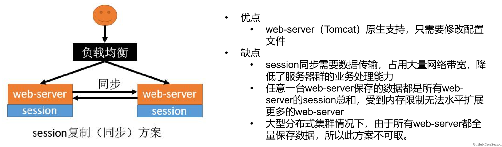
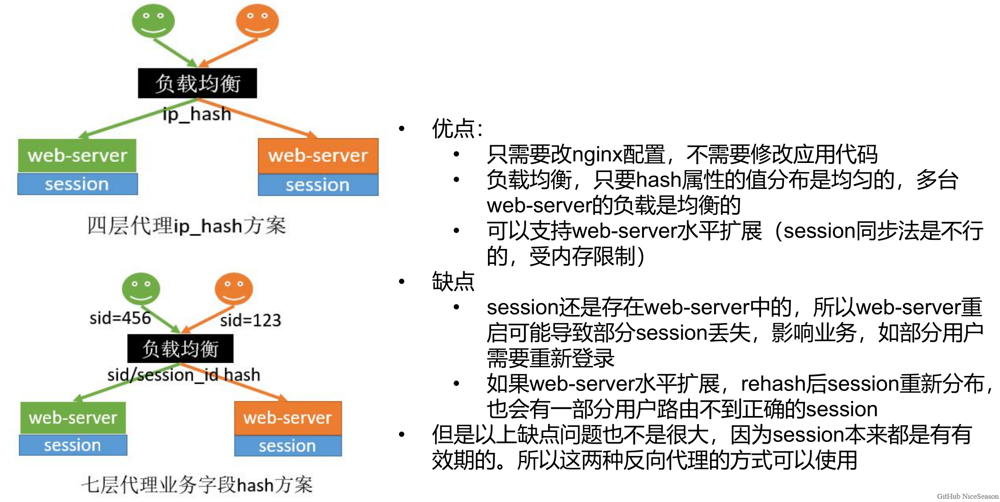

## 认证服务

目标：

1. 基于 OAuth2 实现微博社交登录
2. 解决分布式 session 问题

### 分布式 session 解决方案

> 实现不同微服务模块的 session 共享

#### 1) session 复制

将用户登录后的 session 会话信息复制到别的机器上



#### 2）hash 一致性

根据用户的 ip 地址，之让其访问指定的机器



#### 4）redis 统一存储

将 session 的会话信息保存到 redis 中，让所有服务都来访问 redis 中保存的 session 即可


### SpringSession

#### 使用

1. 导入依赖

   ```java
   <!-- spring-session -->
       <dependency>
       <groupId>org.springframework.session</groupId>
       <artifactId>spring-session-data-redis</artifactId>
       </dependency>
       <!-- redis -->
       <dependency>
       <groupId>org.springframework.boot</groupId>
       <artifactId>spring-boot-starter-data-redis</artifactId>
       </dependency>
   ```

2. 修改配置

   ```yaml
   spring:
     session:
       store-type: redis
       timeout: 30m
     redis:
       host: 192.168.102.150
   ```

3. [修改 cookie 序列化配置] session 基于 cookie，不同二级域名下的 cookie 不共享，所以需要修改 SpringSession 的默认配置，让 cookie 的 domain(作用域) 可以上升到一级域名

   ```java
   @EnableRedisHttpSession // 开始 spring session redis
   @Configuration
   public class SessionConfig {
   
       /**
        * spring session redis 序列化，方便我们查看 redis 中的数据
        * @return
        */
       @Bean
       public RedisSerializer<Object> springSessionDefaultRedisSerializer() {
           return new GenericFastJsonRedisSerializer();
       }
   
       @Bean
       public CookieSerializer cookieSerializer() {
           DefaultCookieSerializer defaultCookieSerializer = new DefaultCookieSerializer();
           // 设置 cookie 的名字
           defaultCookieSerializer.setCookieName("MALL_SESSION_ID");
           // 设置 cookie 的作用域为一级域名
           defaultCookieSerializer.setDomainName("mall.com");
           return defaultCookieSerializer;
       }
   
   }
   ```

4. 在业务中使用 **HttpSession** 即可

   ```java
   @PostMapping("/login/phone")
   public R phoneAuth(@RequestBody BaseAuthVo baseAuthVo, HttpSession session) {
       MemberLoginInfoVo memberLoginInfoVo = baseAuthService.phoneAuth(baseAuthVo);
       // 在 session 中保存用户信息
       session.setAttribute(AuthConstant.SESSION_LOGIN_INFO, memberLoginInfoVo);
       return R.ok();
   }
   ```

#### 原理

### 社交登录

#### OAuth2

SpringSecurity OAuth2 入门：TODO

#### 微博的 OAuth2 配置

1. 进入微博开放平台：https://open.weibo.com/development

2. 先登录，然后完成开发者身份认证：https://open.weibo.com/developers/identity

3. 创建一个网站应用：https://open.weibo.com/apps/new

4. 在 [应用信息/高级信息] 下修改 OAuth2 授权设置

    

5. 可以在接口管理中查看当前应用可以访问的接口

    


