### 基于 renren-fast 快速开发后台管理

1. 拉取项目：

   - 后端: https://gitee.com/renrenio/renren-fast.git
   - 前端：https://gitee.com/renrenio/renren-fast-vue.git
   - 代码生成器：https://gitee.com/renrenio/renren-generator.git

2. 初始化后端项目环境

   1. 克隆下来的 `renren-fast` 有个 db 文件夹，将里面的对应的数据库文件执行

       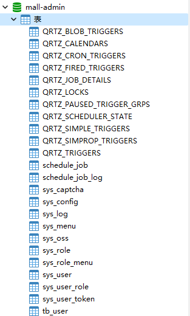

   2. 将 `renren-fast` 文件夹复制到项目根目录下，并修改其名字为 `mall-admin`

   3. 打开 IDEA，修改父工程 pom 文件

      ```yaml
      ...
      	<module>mall-admin</module>
      </modules>
      ```

   4. 修改 `mall-admin` 模块下的 pom 文件

      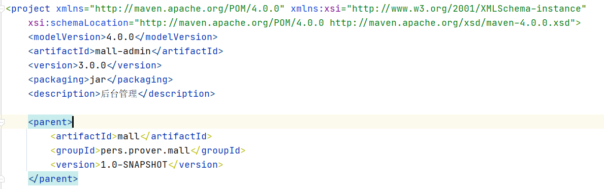

   5. 修改模块名为 `mall-admin`

      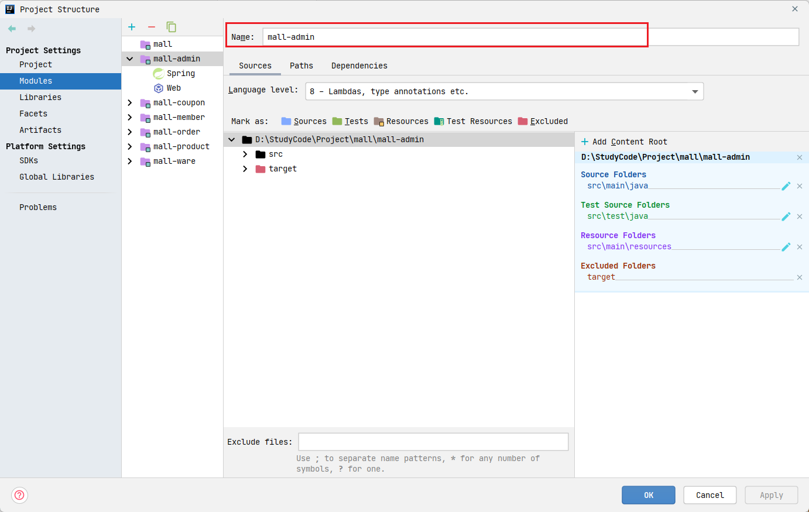

   6. 修改 `application-dev.yaml` 配置数据库连接

      ```yaml
      url: jdbc:mysql://192.168.102.150:3306/mall-admin?useUnicode=true&characterEncoding=UTF-8&serverTimezone=Asia/Shanghai
      username: root
      password: root
      ```

   7. 启动

3. 初始化前端环境

   1. 需要安装 Node 环境(TODO：)

   2. 使用命令行打开项目根目录

      ```shell
      npm install -g cnpm --registry=https://registry.npm.taobao.org
      ```

   3. 启动项目

      ```shell
      npm run dev
      ```

4. 引入 `renren-generator` 并修改文件名和模块名为 `code-generator`

   1. 修改 `resources/template/Controller.java/vm`，将和 **@RequiresPermissions** 注解有关的代码注释

   2. 修改 `application.yaml`

       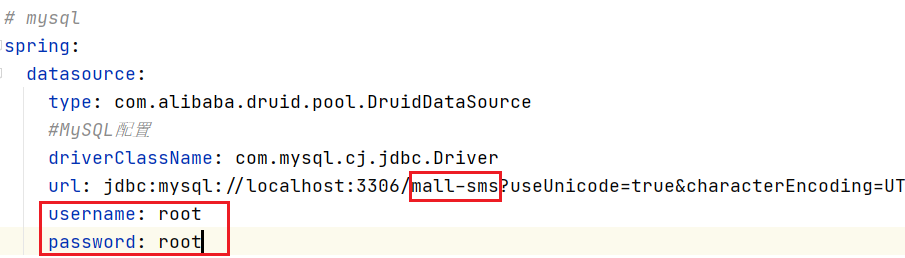

   3. 修改 `generator.properties`

       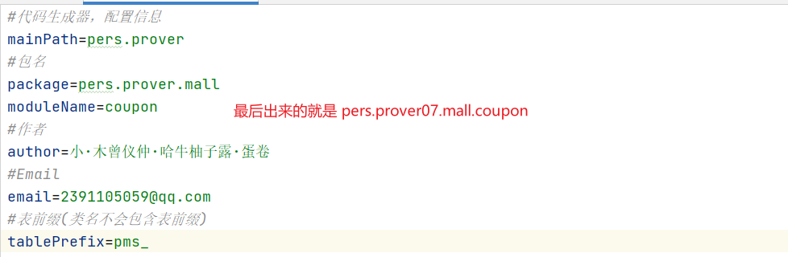

   4. 启动，访问 `localhost:80`

      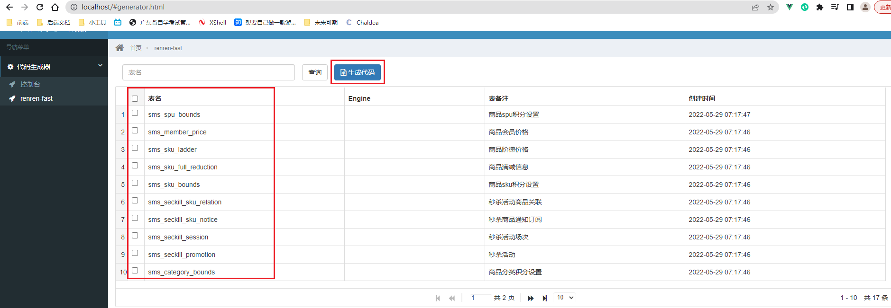

   5. 将生成代码 copy 到对应的微服务模块下即可(tips: 有些类可以没有，可以在 `renren-fast` 中找到)


### 添加页面路由

1. 添加一个**目录**

   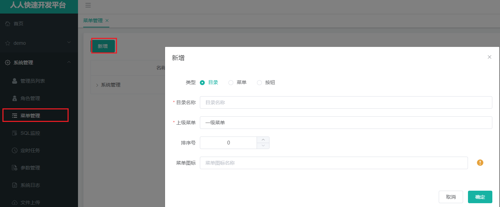

    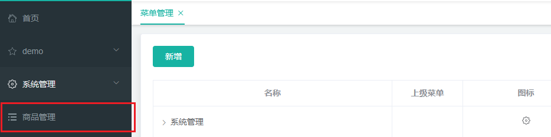

2. 添加一个**菜单**(真正路由到页面的配置)

   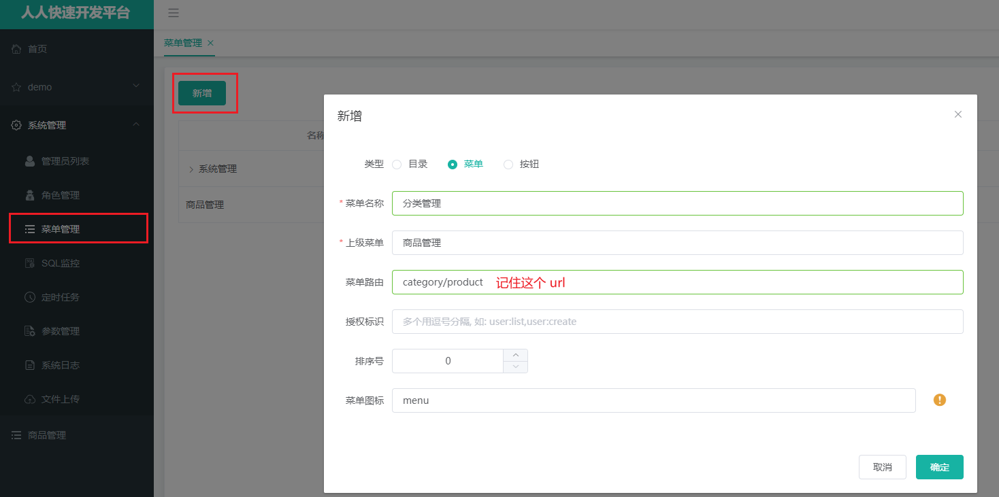

3. 可以在菜单管理中看到相关配置

   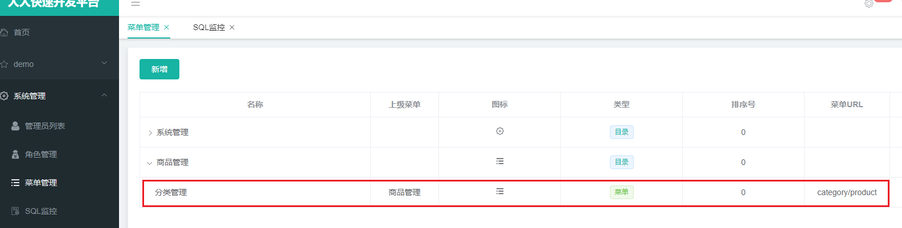

4. 打开 vsc，进入到 `src/views/modules` 目录下，**菜单URL转换成路由规则**： product/category ==> product/category.vue

   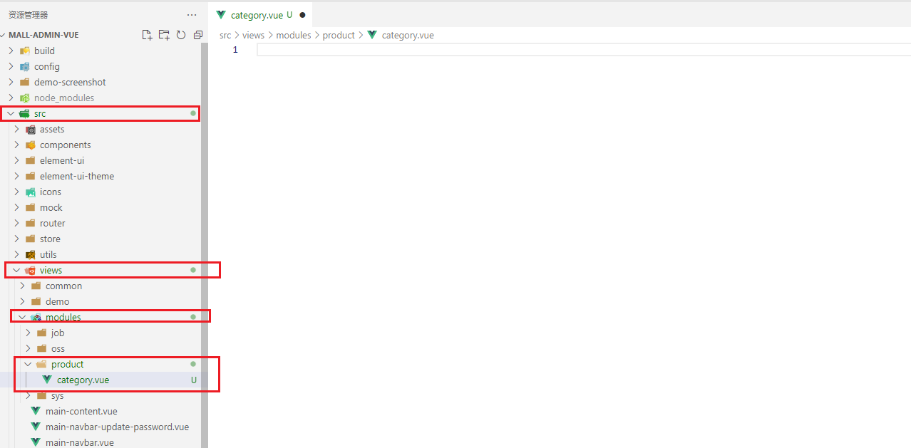


## 